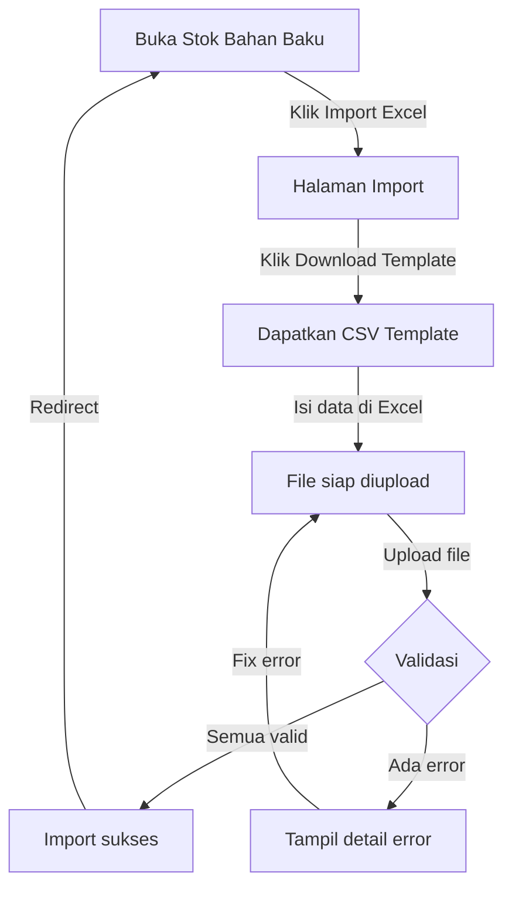

# Fitur Import Data Bahan Baku melalui Excel

## Deskripsi
Fitur ini memungkinkan pengguna untuk mengimport data bahan baku (bar dan dapur) secara massal melalui file Excel atau CSV, sehingga menghemat waktu dibandingkan menginput satu per satu.

## Fitur Utama
✅ **Import Massal**: Tambahkan puluhan/ratusan bahan baku sekaligus  
✅ **Validasi Data**: Sistem otomatis memvalidasi format dan nilai  
✅ **Template Siap Pakai**: Unduh template CSV untuk format yang benar  
✅ **Error Handling**: Laporan detail tentang baris mana yang gagal dan alasannya  
✅ **Batch Processing**: Proses file besar dengan chunking (max 100 baris per batch)  
✅ **Format Fleksibel**: Mendukung .xlsx, .xls, dan .csv (max 5MB)

## Cara Menggunakan

### 1. Akses Halaman Import
- Buka halaman **Stok Bahan Baku & Dapur** (http://localhost:5173/raw-materials)
- Klik tombol **📥 Import Excel** di pojok kanan atas

### 2. Download Template
- Klik tombol **📥 Download Template** untuk mendapatkan file template CSV
- Template berisi kolom yang benar dan contoh data

### 3. Isi Data Bahan Baku
Buka file template dengan Excel/LibreOffice dan isi kolom berikut:

| Kolom | Tipe | Contoh | Keterangan |
|-------|------|--------|-----------|
| name | Text | Kopi Arabika | Nama bahan (max 255 karakter) |
| category | Text | dapur | Hanya boleh "bar" atau "dapur" |
| unit | Text | kg | Satuan (gr, kg, ml, liter, pcs, dll) |
| stock | Angka | 50 | Jumlah stok awal (tidak boleh negatif) |

**Contoh Data Benar:**
```
name,category,unit,stock
Kopi Arabika,dapur,kg,50
Susu Cair,bar,liter,30
Gula Pasir,dapur,kg,25
Es Batu,bar,pcs,100
Teh Premium,dapur,gram,500
```

### 4. Upload File
- Di halaman Import, drag & drop file Excel/CSV atau klik untuk memilih file
- Ukuran file maksimal 5MB
- Format support: .xlsx, .xls, .csv

### 5. Lihat Hasil Import
- Jika semua data valid: Tampil pesan sukses dengan jumlah bahan yang berhasil diimport
- Jika ada error: Tampil tabel detail dengan baris mana yang gagal dan alasannya

## Validasi Data

Sistem akan menolak data jika:

| Kondisi | Error Message |
|---------|---------------|
| Kolom name kosong | "Kolom nama bahan tidak boleh kosong" |
| Name lebih dari 255 karakter | "Nama bahan maksimal 255 karakter" |
| Kolom category kosong | "Kolom kategori (bar/dapur) harus diisi" |
| Category bukan "bar" atau "dapur" | "Kategori hanya boleh \"bar\" atau \"dapur\"" |
| Kolom unit kosong | "Kolom unit (gr, ml, pcs, dll) harus diisi" |
| Unit lebih dari 50 karakter | "Unit maksimal 50 karakter" |
| Kolom stock kosong | "Kolom stok harus diisi" |
| Stock bukan angka | "Stok harus berupa angka" |
| Stock negatif | "Stok tidak boleh negatif" |

## API Endpoints

### 1. Import Raw Materials
```
POST /api/raw-materials/import
Content-Type: multipart/form-data

Form Data:
- file: [Excel/CSV file]

Response Success (201):
{
  "status": "success",
  "message": "Import data bahan baku berhasil",
  "imported_count": 42
}

Response Warning (200):
{
  "status": "warning",
  "message": "Import sebagian berhasil dengan beberapa kesalahan",
  "imported_count": 40,
  "failed_rows": [
    {
      "row": 11,
      "attribute": "category",
      "errors": ["Kategori hanya boleh \"bar\" atau \"dapur\""],
      "values": {"name": "Kopi", "category": "invalid", "unit": "kg", "stock": 50}
    }
  ]
}

Response Error (422/500):
{
  "status": "error",
  "message": "Error description",
  "errors": [...]
}
```

### 2. Download Template
```
GET /api/raw-materials/import/template

Response: File CSV (Content-Type: text/csv)
```

## Struktur Backend

### File yang Dibuat:

1. **app/Imports/RawMaterialImport.php**
   - Handles Excel row parsing
   - Validates each row
   - Returns RawMaterial model instances
   - Tracks failed rows dan success count

2. **app/Http/Controllers/Api/ImportController.php**
   - `importRawMaterials()`: Process file upload dan return hasil
   - `downloadTemplate()`: Generate dan return CSV template

3. **routes/api.php**
   - `POST /api/raw-materials/import`
   - `GET /api/raw-materials/import/template`

### Package yang Ditambahkan:
- `maatwebsite/excel` ^4.0.2

## Struktur Frontend

### File yang Dibuat:

1. **src/pages/RawMaterialImport.tsx**
   - Upload form dengan drag & drop
   - File validation (type, size)
   - Template download
   - Error display dengan detail per row
   - Success feedback dan navigation

2. **src/App.tsx**
   - Route: `/raw-materials/import`
   - Protected route (role: developer, owner, manager)

3. **src/pages/RawMaterials.tsx** (updated)
   - Tombol "📥 Import Excel" di header

## Contoh Workflow End-to-End



## Troubleshooting

### File tidak ter-upload
- Pastikan format file benar (.xlsx, .xls, atau .csv)
- Pastikan ukuran file tidak melebihi 5MB
- Pastikan header kolom sesuai: name, category, unit, stock

### Validasi terus gagal
- Periksa kolom category hanya "bar" atau "dapur"
- Pastikan stock adalah angka (bukan text)
- Pastikan tidak ada spasi di depan/belakang nilai
- Gunakan template yang sudah diunduh sebagai referensi

### Import tiba-tiba lambat
- Untuk file besar (>500 baris), sistem akan memproses dalam batch
- Tunggu hingga selesai, jangan refresh halaman

## Keamanan

✅ Validasi file type & size  
✅ SQL Injection prevention via Eloquent ORM  
✅ Authorization checks (hanya manager/owner/developer)  
✅ Max file size 5MB  
✅ Batch processing untuk mencegah timeout  

## Limitasi

- Max file size: 5MB
- Chunk size: 100 rows per batch
- Supported format: .xlsx, .xls, .csv
- Category hanya: "bar" atau "dapur"
